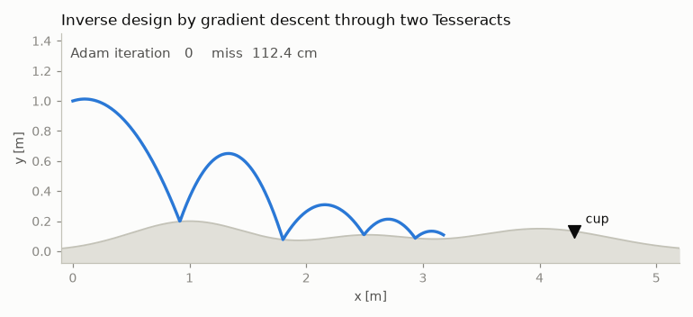

# impact-adjoint

**End-to-end gradients through impact events, across a Julia↔JAX Tesseract
boundary.** Tesseract Hackathon 2026 — Track 1 (inverse design & shape
optimization), cross-listed Track 4 (differentiable inference).

Naive automatic differentiation through a time-stepping simulator is *silently
wrong* the moment the dynamics have events: the gradient of an impact time with
respect to parameters (the saltation term) is structurally absent from the
program autodiff sees. This repo composes two Tesseracts into one
`jax.grad`-able pipeline that gets it right:

- **`tesseracts/contact_sim`** — Julia. 2D ballistic flight over smooth bumpy
  terrain with impact events (normal restitution `e`, tangential loss `mu`).
  RK4 with event bisection; gradients from forward variational equations with
  analytic **saltation-matrix** updates at every impact. Exposes
  `apply` / `jacobian` / `jacobian_vector_product` / `vector_jacobian_product`
  / `abstract_eval`.
- **`tesseracts/score_target`** — JAX. Differentiable scoring of the final
  state against a target cup.

The boundary the pipeline crosses is not just language: the two components
*disagree about how to differentiate* (dual-number forward AD + analytic event
handling vs. reverse-mode autodiff), and `tesseract-jax` composes them anyway.



## Results

| Experiment | Result |
|---|---|
| **E3** — naive autodiff vs saltation | naive gradient is exactly **0.0 at every dt** (event-index staircase); true value **+0.0904**, confirmed by two independent witnesses. O(1) bias, does not vanish as dt→0. |
| **E1** — inverse design | Adam over launch velocity + restitution through both Tesseracts: miss **1.12 m → 2.7 cm**, through 5 bounces, surviving bounce-count changes (4→6→5) during descent. |
| **E2** — calibration | `(e, mu)` recovered from 3 noisy impact positions (σ = 5 mm) to errors **0.002 / 0.009**. |

## Correctness

The gradients are validated against **solver-independent oracles**, not just
finite differences through the same code:

- `scripts/validate_closed_form.py` — full multi-bounce closed form on flat
  terrain, derived in sympy rational arithmetic (including hand-differentiated
  impact recursions): Jacobian agreement **7e-12**.
- `scripts/validate_reference.py` — an independent reimplementation of the spec
  (scipy RK45 + its own event localization): primal agreement 1e-10; analytic
  Jacobian vs finite differences *through the independent implementation*
  **5e-9** — covering the sloped-contact-frame and drag sectors.
- `scripts/validate_contact.py` — FD gate (rtol 1e-5) plus robustness
  regressions: chatter/settle termination, event-capacity truncation,
  sub-step-width terrain features, energy conservation at `e=1` (relative
  drift 5e-13), and `jax.grad` end-to-end.

Trajectories that leave the model's validity region **terminate with an explicit
status** (event capacity / settled contact) and still return well-defined
total-derivative Jacobians at the truncation point, so optimization loops never
consume silently nonphysical states.

## Reproduce

Requires Python ≥ 3.12, Docker (for containerized runs), and ~2 GB disk for the
Julia image. Julia itself is bootstrapped automatically by `juliacall`.

```bash
python -m venv .venv && source .venv/bin/activate
pip install "tesseract-core[runtime]" tesseract-jax jax optax equinox \
            juliacall numpy scipy sympy matplotlib

# validation (dev mode, no Docker needed)
python scripts/validate_contact.py
python scripts/validate_closed_form.py
python scripts/validate_reference.py

# experiments
python experiments/e3_naive_vs_saltation.py
python experiments/e1_inverse_design.py
python experiments/e2_calibration.py
python experiments/make_figures.py

# containerized (any docker-compatible engine; needs buildx)
tesseract build tesseracts/contact_sim
tesseract build tesseracts/score_target
```

The first Julia call pays a one-time JIT warmup (~30 s).

## Model and scope (honest limitations)

- Impact law: kinematic Newton restitution + tangential retention factor —
  not a full Coulomb friction cone; sticking/sliding contact modes are out of
  scope and trajectories entering them terminate with `status=2`.
- Gradients are exact for the continuous hybrid system at fixed event topology;
  across bounce-count boundaries the objective is discontinuous (inherent to
  the physics, visible and handled in E1).
- Event detection resolves terrain features wider than `|vx|·dt/3`
  (documented per-input); grazing impacts have a `δ^(-1/2)` sensitivity growth
  near tangency.

See `docs/writeup.md` for the technical writeup.

## License

Apache License 2.0.
