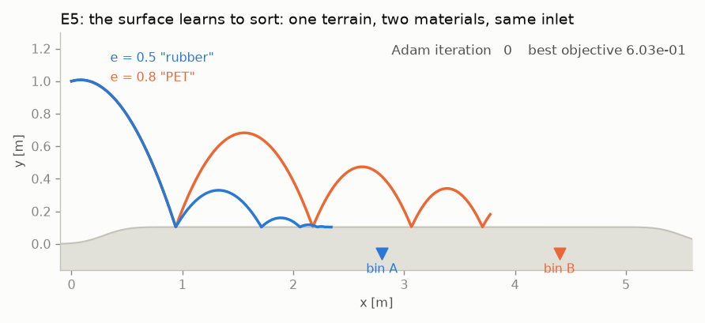
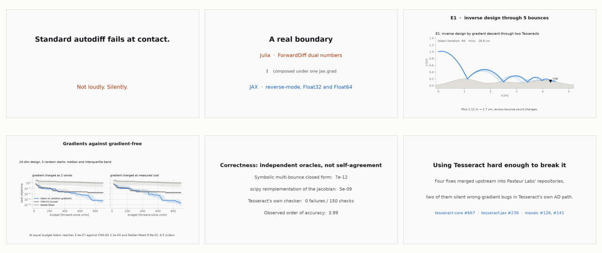
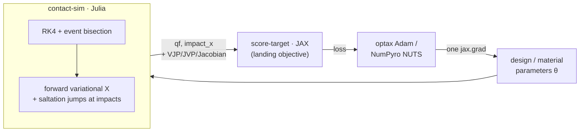

# impact-adjoint

[](https://github.com/singhharsh1708/impact-adjoint/actions/workflows/test.yaml)
[](LICENSE)
[](https://impact-adjoint.vercel.app)
[](https://doi.org/10.5281/zenodo.22117930)

**Documentation: [impact-adjoint.vercel.app](https://impact-adjoint.vercel.app)**

**Simulate a bouncing ball in JAX the natural way, applying the impact at
the integrator step where it is detected, and `jax.grad` returns `d x(T)/d
v0y = 0.0` exactly on flat terrain, when the truth is `+0.09`.**
impact-adjoint fixes this exactly, using classical saltation-matrix event
sensitivities served from a Julia solver through a Tesseract boundary. The
gradients then design passive structures whose function only exists because
of impacts.


*One terrain, two materials, same inlet: gradient descent through every
impact of both trajectories reshapes the surface until restitution alone
routes each particle to its own bin.*

**Tesseract Hackathon 2026, Track 1: inverse design & shape optimization.**
(The Bayesian calibration and design-under-uncertainty experiments also touch
Track 4, but Track 1 is the entry's track.)

## Demo

[](https://impact-adjoint.vercel.app/#demo)

*A 73-second walkthrough:
**[watch it here](https://impact-adjoint.vercel.app/#demo)**. Generated by
`python scripts/make_demo_video.py`, which reads every number on every card
from `experiments/results.json` and runs the boundary proof live at build
time, so the video agrees with the artifacts for the same reason the figures
do.*

What the gradients design and infer:

- a **24-parameter resilience separator** that sorts particles by how far
  they bounce (the documented industrial cousins are seed resilience
  separators and potato/stone bounce rollers),
- **terrain** that routes different inlet speeds to different cups,
- **Bayesian recovery of material parameters** from where things actually hit.

Building it also turned up two silent wrong-gradient bugs inside Tesseract
itself, both now fixed upstream:
[tesseract-core #667](https://github.com/pasteurlabs/tesseract-core/pull/667)
and [tesseract-jax #236](https://github.com/pasteurlabs/tesseract-jax/pull/236),
alongside two mosaic harness fixes. See
[upstream fixes](#upstream-fixes-from-this-work).

## Contents

- [Architecture](#architecture) · [Results](#results) · [Correctness](#correctness)
- [Performance envelope](#performance-envelope) · [Reproduce](#reproduce) · [Troubleshooting](#troubleshooting)
- [Repository structure](#repository-structure) · [Limitations](#model-and-scope-honest-limitations) · [Future work](#future-work)
- [Upstream fixes](#upstream-fixes-from-this-work) · [References](#references)

## Architecture



The two components *disagree about how to differentiate*. One side uses
dual-number forward AD plus analytic event handling in a Julia process, the
other reverse-mode tracing in JAX, and `tesseract-jax` composes them into a
single `jax.grad` anyway. The same solver container also serves NumPyro's HMC over HTTP and a
raw `curl` client, unchanged.

- **`tesseracts/contact_sim`** (Julia). 2D ballistic flight over configurable
  Gaussian-bump terrain with impact events (restitution `e`, tangential loss
  `mu`); all differentiable Tesseract endpoints, gradients from forward
  variational equations with analytic **saltation-matrix** updates at events.
- **`tesseracts/score_target`** (JAX). Differentiable landing objective.
- (`tesseracts/julia_kernel` is the minimal Day-1 boundary proof, driven by
  `scripts/proof_local.py` / `scripts/proof_container.py`.)

## Results

| Experiment | Headline |
|---|---|
| **E3**, the failure measured | Grid-reset autodiff gives `d x(T)/d v0y` = **exactly 0.0 at every dt** (truth +0.0904; the exact zero is specific to this flat-terrain case, on curved terrain it is nonzero and wrong). The pure-JAX repair converges only by hand-implementing event sensitivity. |
| **E5**, 24-dim resilience separator | At a shared budget of 900 forward-solve units with a gradient charged as 2: Adam on saltation gradients reaches **2×10⁻⁷** against CMA-ES 2×10⁻³ and Nelder-Mead 2×10⁻², four to five orders on the objective it was given. One caveat, measured and in the writeup: the objective gap does not translate to held-out purity, where Nelder-Mead matches Adam with a wider margin. (Under wall-clock accounting the ordering reversed in our favour once the variational step was factored, a gradient costing 1.61 solves and Adam ahead on all 5 seeds, but that is a property of this implementation rather than of the methods.) We claimed E5b was where the gradient pays; we measured it and it is not, so the claim is withdrawn. CMA-ES reaches a better ensemble design at a matched budget. What buys the robustness is the ensemble objective, not the gradient that optimises it. |
| **E5b**, design under uncertainty | Ensemble objective over inlet and restitution scatter. Held-out purity 199/200 for the point design and 200/200 after refinement on one draw; over five independent ensembles, 983/1000 against 997/1000 with non-overlapping Wilson intervals (McNemar p = 0.0026). The fifth-percentile margin improves 0.05 m to 0.49 m, though the worst case stays inside the wrong bin. |
| **E6**, zero-shot generalization | Trained on two materials, sorts the whole continuum e ∈ [0.35, 0.875] with **one threshold**. |
| **E1**, inverse design | Miss **1.12 m → 2.7 cm** through 5 bounces, across bounce-count changes. |
| **E2/E2b**, calibration | NUTS posterior `e = 0.697 ± 0.007`, `mu = 0.096 ± 0.009`; truth inside both 95% CIs, 0 divergences. |
| **E4**, terrain design | One terrain routes two inlet speeds to two cups (miss 2.2 / 3.0 cm). |


*The thesis in one figure: the natural autodiff program returns exactly zero
at every step size (left); the pure-JAX repair converges erratically, and
only the saltation endpoint is exact at any dt (right).*


*The designed separator (left) and the 24-dimensional head-to-head (right):
at equal budget, on this run, CMA-ES ends 3.9 and Nelder-Mead 4.9 orders above
Adam on objective value; on held-out sorting purity the gap nearly vanishes.*

## Correctness

The gradients are validated against **solver-independent oracles** as well
as finite-difference gates through the solver itself:

- `scripts/validate_closed_form.py` runs the full multi-bounce closed form on flat
  terrain, derived in sympy rational arithmetic (including hand-differentiated
  impact recursions): Jacobian agreement **7e-12**. All four oracle agreements
  on this list are recorded in `experiments/oracle_results.json` by the
  validators themselves rather than read off a terminal.
- `scripts/validate_reference.py` is an independent reimplementation of the spec
  (scipy RK45 + its own event localization): primal agreement 1e-10; analytic
  Jacobian vs finite differences *through the independent implementation*
  **5e-9**, covering the sloped-contact-frame and drag sectors.
- `tesseract run contact-sim check-gradients` is Tesseract's built-in checker:
  **0 failures / 150 checks** across the three gradient endpoints at
  `rtol = 1e-4`, captured by
  `scripts/capture_check_gradients.py` into `experiments/check_gradients.json`.
  The CLI defaults to `rtol = 0.1`, which measures the sampler rather than the
  gradient, so this runs at a tolerance the oracles justify instead. Two
  caveats on the count. The checker samples with replacement whatever the
  budget, and the payload has 14 differentiable elements across two output
  paths, so those 150 checks are about 76 distinct comparisons and the rest
  are repeats; the denominator is the checker's, not a count of independent
  tests. And the draw is seeded (`SEED = 7`, recorded in the artifact) so the
  numbers reproduce, which fixes repeatability rather than making one draw
  representative: at `rtol = 1e-5` other seeds give 12, 20 and 21 failures
  where this one gives 14. At the same `eps = 1e-6` it first fails at
  `rtol = 1e-5` (14 of 150 checks across the three endpoints), which is where
  the central difference itself stops resolving rather than where the gradient
  does. The whole sweep is recorded in the artifact.
- `scripts/validate_contact.py` is an FD gate (rtol 1e-5) plus robustness
  regressions: chatter/settle termination, event-capacity truncation,
  sub-step-width terrain features, energy conservation at `e=1` (relative
  drift 5e-13), and `jax.grad` end-to-end.

Trajectories that leave the model's validity region **terminate with an
explicit status** (event capacity / settled contact) and still return
well-defined total-derivative Jacobians at the truncation point, so
optimization loops never consume silently nonphysical states.

## Verification studies

Beyond the correctness oracles above, six studies measure the machinery
itself. Every number is collected into [docs/RESULTS.md](docs/RESULTS.md) by
`experiments/collect_results.py`, read from the committed artifacts rather
than retyped.


*Order 3.99 on a smooth arc against the analytic solution; gradient-vs-FD
V-curves bottoming below 1e-8 on four probes; cost affine in parameter count
at R2 = 0.998.*


*Five random starts, both methods tuned per seed. Per evaluation Adam ends
about 347x below tuned CMA-ES on the paired per-seed median. Charged at
measured wall-clock, where each gradient now costs 1.61 solves rather than the
6.8 it cost before the variational step was refactored, Adam is ahead on all 5
seeds. That reversal is a property of our implementation, not of the methods:
we made our own gradient cheaper and the accounting followed. Both are
reported.*


*Five independent ensembles: 983/1000 vs 997/1000 with non-overlapping
Wilson intervals, and the fifth-percentile margin improving 0.05 m to
0.49 m. The worst case stays inside the wrong bin for both, going -0.12 m to
-0.35 m. Under inlet jitter the point design is indecisive at 2 of 20
restitutions, including its own trained value; the ensemble design at none.*

## Performance envelope

Warm per-call cost of the solver component, measured by
`experiments/study_scaling.py` and read from `scaling_result.npz` (M-series
CPU, dev mode, `dt` 1e-3, `t_final` 2.0 s, four impacts; the container adds
~10 ms HTTP overhead per call):

| call | 3 bumps, 14 params | 24 bumps, 77 params | 192 bumps, 581 params |
|---|---|---|---|
| `apply` | 2.2 ms | 2.8 ms | 8.6 ms |
| `vector_jacobian_product` | 7.2 ms | 8.0 ms | 15.8 ms |
| ratio | 3.3× | 2.8× | 1.8× |

Gradients are forward-variational, so VJP cost grows with parameter count:
15 µs per parameter, affine out to 581 parameters at R² = 0.998. These are
wall-clock figures from one run on a shared laptop, and repeat runs move them:
a second run of the same study measured the slope at 14.4 µs with R² 0.998, a
3.9% spread, both recorded in `experiments/scaling_repeats.json`. The affine
shape holds; the absolute figures carry a few percent of run to run
spread, and the conclusions resting on them are hedged accordingly. `study_optimizers.py` remeasures the charge for its own objective, as the
wall-clock cost of the endpoint as it is actually called rather than a
per-column figure, and gets 1.61 forward solves.

## Reproduce

> [!TIP]
> **Figures in one minute:** all experiment results are committed as
> `experiments/*.npz` / `*.npy`, so
> `python experiments/make_figures.py && python experiments/make_e5_figure.py &&
> python experiments/make_e5b_figure.py && python experiments/make_study_figures.py &&
> python experiments/make_design_comparison_figure.py`
> regenerates all twelve static figures without rerunning any optimization
> (after the Julia bootstrap). The two GIFs come from `make_animation.py`,
> which replays the committed E1 parameter history, and
> `make_e5_animation.py`, which does re-run its optimization.

Requires Python ≥ 3.12, Docker (for containerized runs), and ~9 GB disk for
the Docker images (contact-sim ~3.8 GB, score-target ~1.3 GB). Julia itself
is bootstrapped automatically by `juliacall`.

```bash
python3 -m venv .venv && source .venv/bin/activate
pip install -r docs/requirements-repro.txt

# validation (dev mode, no Docker needed)
python scripts/proof_local.py              # 5 s boundary proof
python scripts/validate_contact.py
python scripts/validate_closed_form.py
python scripts/validate_reference.py
pytest tests/

# experiments (dev mode)
python experiments/e3_naive_vs_saltation.py
python experiments/e1_inverse_design.py
python experiments/e2_calibration.py
python experiments/e4_terrain_design.py
python experiments/e5_separator.py          # ~30 s warm: 3 optimizers x 900 evals
python experiments/e5b_robust_separator.py  # ~10 min: ensemble design + purity eval
python experiments/e6_generalization.py

# verification studies (write the artifacts behind docs/RESULTS.md)
python experiments/study_convergence.py
python experiments/study_gradient_accuracy.py
python experiments/study_scaling.py
python experiments/study_optimizers.py          # ~25 min: 5 seeds x tuned grids
python experiments/study_robustness_stats.py    # ~10 min
python experiments/study_generalization_stats.py  # ~15 min
python experiments/make_study_figures.py
python experiments/collect_results.py

# containerized (any docker-compatible engine; needs buildx; ~10 min for contact-sim)
tesseract build tesseracts/contact_sim
tesseract build tesseracts/score_target
tesseract run contact-sim check-gradients @tesseracts/contact_sim/check_payload.json
python experiments/e2b_bayesian.py                   # NUTS, 2 chains: ~23 min
python experiments/e1_inverse_design.py --container  # same optimization via the served images
tesseract serve -p 8123 contact-sim &                 # the curl client needs this
./scripts/second_client_curl.sh                      # gradients with nothing but curl
```

> [!NOTE]
> The Julia bootstrap runs in two stages: the first call builds a project
> environment (and installs Julia itself if absent), and the first script that
> needs `ForwardDiff` pays a second install and precompile. A cold clone
> measured about eight minutes across the validation block; warm runs take
> seconds. Measured budget: about 5 minutes for the
> validation block and experiments E1 to E6, plus ~10 minutes for
> `e5b_robust_separator.py`, plus ~10 minutes to build the contact-sim image
> and ~23 minutes for the two NUTS chains.

## Troubleshooting

| Symptom | Cause / fix |
|---|---|
| `tesseract` runs an OCR tool | PATH collision with Tesseract-OCR; use the venv's `tesseract` binary. |
| Wall of `[juliapkg] Installing...` output | One-time Julia bootstrap; subsequent runs are warm. |
| `docker build` fails with `unknown flag: --load` | Docker buildx plugin missing (common with colima/podman setups). |
| Container cannot write outputs (colima/VM setups) | Pass an `output_path` under your home directory; VM file sharing may not cover system temp dirs. |

## Repository structure

```
tesseracts/    contact_sim (Julia solver) · score_target (JAX objective) · julia_kernel (Day-1 proof)
experiments/   e1-e6, e5b + figure/animation generators + committed result artifacts
scripts/       three validation oracles · boundary proofs · curl client
tests/         49 tests: golden regressions plus no-drift guards. Four need
               Sphinx and skip without it; CI installs it so all 49 run
docs/          technical writeup, all figures, and the site source (docs/site)
```

## Model and scope (honest limitations)

- Impact law: kinematic Newton restitution plus a tangential retention
  factor, not a full Coulomb friction cone; sticking/sliding contact modes are out of
  scope and trajectories entering them terminate with `status=2`.
- Gradients are exact for the continuous hybrid system at fixed event topology;
  across bounce-count boundaries the objective is discontinuous (inherent to
  the physics, visible and handled in E1).
- Event detection resolves terrain features wider than `|vx|·dt/3`
  (documented per-input); grazing impacts have an inherent `δ^(-1/2)`
  sensitivity growth near tangency.

## Future work

- **Reverse-mode saltation adjoint.** The parameter-count argument for this is
  largely gone: at 15 µs per parameter a VJP at 581
  parameters costs 1.8x a forward solve. What remains is
  state dimension. The tangent map is 4x4 here because the state is
  four-dimensional; in 3D with multiple bodies it is not, and a backward
  costate integration with `Sᵀ` jumps at events becomes the cheaper side of
  the trade.
- **Coulomb friction cone.** The impulse-ratio (Routh) reset is a ~4-line
  change to `reset_map`, at the cost of re-deriving the closed-form oracle;
  it would extend the model into sticking and sliding contact.
- **3D and multi-body.** The saltation machinery is dimension-agnostic; the
  work is in guard geometry and event bookkeeping, not the sensitivities.
- **Upstream.** Test the tesseract-jax fix for
  [#234](https://github.com/pasteurlabs/tesseract-jax/issues/234) against this
  solver once it lands.

See [docs/writeup.md](docs/writeup.md) for the technical writeup.

## References

- Aizerman & Gantmacher (1958); Hiskens & Pai, *IEEE TCAS* (2000); Kong,
  Payne, Zhu & Johnson, *Proc. IEEE* (2024). The saltation-matrix lineage.
- Suh, Simchowitz, Zhang & Tedrake, *ICML* (2022), on the bias of simulator
  gradients through contact.
- [Tesseract Core](https://github.com/pasteurlabs/tesseract-core) ·
  [Tesseract-JAX](https://github.com/pasteurlabs/tesseract-jax) provide the
  component boundary this entry is built on.

## Upstream fixes from this work

Problems found while building this and reported upstream during the hackathon
period. Four of the fixes are merged, the two Tesseract PRs and the two Mosaic
harness fixes; the juliacall deadlock issue is still open:

| Where | What |
|---|---|
| [core#666](https://github.com/pasteurlabs/tesseract-core/issues/666) / [PR #667](https://github.com/pasteurlabs/tesseract-core/pull/667) | VJP cache compared keys by hash alone, so a collision silently served another input's gradient. Reproduced on the shipped `vectoradd_jax` example. |
| [jax#235](https://github.com/pasteurlabs/tesseract-jax/issues/235) / [PR #236](https://github.com/pasteurlabs/tesseract-jax/pull/236) | `jax.jvp` returned another element's tangent for partially-differentiated list inputs, disagreeing with `jax.grad` silently. |
| [jax#234](https://github.com/pasteurlabs/tesseract-jax/issues/234) | Jitted callbacks deadlock Tesseracts embedding an in-process Julia runtime ([reproducer](https://github.com/singhharsh1708/tesseract-jax-234-repro)). |
| [mosaic#126](https://github.com/pasteurlabs/mosaic/pull/126), [#141](https://github.com/pasteurlabs/mosaic/pull/141) | Harness fixes: Docker setup diagnostics, anomaly status reporting. |

## Author

Harsh Singh ([@singhharsh1708](https://github.com/singhharsh1708)), solo
entry. Questions: open an issue on this repository.

## License

Apache License 2.0.
