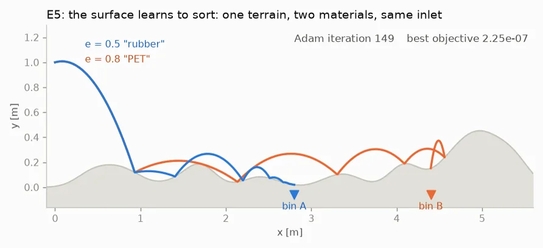

# impact-adjoint

Exact gradients through impact events, across a Julia and JAX Tesseract
boundary.

:::{container} ia-byline
**Harsh Singh** · independent work

Tesseract Hackathon 2026 entry, Track 1: inverse design and shape
optimization. Version {{ version }}.
:::

:::{container} ia-cta
[Get started](getting-started.md){.ia-cta-primary}
[Write-up](https://github.com/singhharsh1708/impact-adjoint/blob/main/docs/writeup.md)
[Code](https://github.com/singhharsh1708/impact-adjoint)
[Results](results.md)
[Cite](citing.md)
:::

:::{container} ia-abstract
Simulations of contact are easy to write and hard to differentiate.
impact-adjoint computes parameter sensitivities across impact events that
are exact for the hybrid system at fixed event topology, using the classical
saltation matrix, and serves them from a Julia solver
through a Tesseract component boundary, so a JAX program obtains the true
derivative without doing any event handling of its own. The resulting
gradients design passive structures whose function exists only because of
impacts.
:::

```{raw} html
<div class="ia-claim">
Simulate a bouncing ball in JAX the natural way, applying the impact at the
integrator step where it is detected, and <code>jax.grad</code> returns
<strong class="ia-zero">d x(T)/d v0y = 0.0</strong> exactly on flat terrain.
The true value is <strong class="ia-zero">+0.09</strong>.
</div>
```

The gradient is not noisy or approximate. It is confidently, silently wrong,
and refining the step size does not help, because the step at which the event
fires is an integer and autodiff cannot differentiate it.

## See it fail, then see it fixed

Both snippets below run as written. The only difference is where the impact
is applied.

::::{grid} 2
:gutter: 3
:class-container: ia-faildemo

:::{grid-item-card} The natural JAX program
:class-card: ia-fail
:class-header: ia-fail-head

The impact is applied at the integrator step where it is detected.

```python
def bounce(v0y, n=2000):
    dt = 2.0 / n

    def step(q, _):
        qn = rk4(q, dt)
        hit = (qn[1] < 0) & (q[1] > 0)
        qn = jnp.where(hit, reset(qn), qn)
        return qn, None

    q0 = jnp.array([0., 1., 2., v0y])
    qf, _ = jax.lax.scan(
        step, q0, None, length=n)
    return qf[0]

jax.grad(bounce)(0.5)
# 0.0
```

The step at which the event fires is an integer. Autodiff differentiates a
staircase, and returns zero at every `dt`. Hand-writing an interpolated event
inside the program does recover a converging gradient, to within 0.3% here;
what the component removes is the derivation, not the last three digits.
:::

:::{grid-item-card} The same call through impact-adjoint
:class-card: ia-fix
:class-header: ia-fix-head

The impact is applied at the crossing, and its time carries a derivative.

```python
API = ("tesseracts/contact_sim"
       "/tesseract_api.py")
sim = Tesseract.from_tesseract_api(API)

def bounce(v0y):
    cfg = {**CFG,
           "v0": jnp.array([2.0, v0y])}
    out = apply_tesseract(sim, cfg)
    return out["qf"][0]

jax.grad(bounce)(0.5)
# 0.09037773625811413
```

The saltation matrix supplies the missing term at each impact. Exact at any
`dt`, with no event handling in the JAX program.
:::

::::

## Move the slider

```{raw} html
<div id="ia-sweep"></div>
```

## What the gradients build

```{raw} html
<figure class="ia-video" id="fig-sorter">
  <video controls autoplay muted loop playsinline preload="metadata"
         poster="_static/e5_learning_poster.webp" width="892" height="408"
         aria-describedby="fig-sorter-caption">
    <source src="_static/e5_learning.mp4" type="video/mp4">
    
  </video>
  <figcaption id="fig-sorter-caption">
    One terrain, two materials, same inlet. Gradient descent through every
    impact of both trajectories reshapes the surface until restitution alone
    routes each particle to its own bin. The poster frame is the converged
    design.
  </figcaption>
</figure>
<script>
  // Readers who ask for reduced motion get the converged frame, not the loop.
  (() => {
    const v = document.querySelector(".ia-video video");
    if (v && window.matchMedia("(prefers-reduced-motion: reduce)").matches) {
      v.removeAttribute("autoplay");
      v.removeAttribute("loop");
      v.pause();
    }
  })();
</script>
```

```{raw} html
<dl class="ia-figures">
  <div><dt>3.99</dt><dd>observed order of accuracy, against an analytic solution</dd></div>
  <div><dt>10<sup>-12</sup></dt><dd>multi-bounce agreement with a symbolic closed form</dd></div>
  <div><dt>0 / 50</dt><dd>failures in Tesseract's gradient checker, at 10<sup>-4</sup> relative tolerance</dd></div>
  <div><dt>4.6e-9</dt><dd>analytic Jacobian vs an independent scipy reimplementation</dd></div>
  <div><dt>~5 min</dt><dd>to re-run the four verification checks</dd></div>
</dl>
```

## Reproduce in five minutes

CPU only, no Docker, no GPU. The four checks themselves take about five
minutes; the first run adds a few minutes of `pip install` and one Julia
bootstrap, so budget nearer fifteen from a genuinely cold machine.

{{ repo_note }}

```bash
git clone https://github.com/singhharsh1708/impact-adjoint
cd impact-adjoint
python3 -m venv .venv && source .venv/bin/activate
pip install -r docs/requirements-repro.txt

python scripts/proof_local.py          # boundary proof
python scripts/validate_closed_form.py # symbolic oracle
python scripts/validate_reference.py   # scipy oracle
python experiments/e3_naive_vs_saltation.py
```

The last command is the claim at the top of this page: it prints the
grid-reset gradient as exactly `0.0` at every step size, next to the
saltation gradient. Full instructions are in
[getting started](getting-started.md).

## Where to start

::::{grid} 3
:gutter: 2

:::{grid-item-card} The problem
:link: problem
:link-type: doc

Why autodiff returns a wrong gradient at an impact, what the pure-JAX repair
costs, and what Diffrax can and cannot do about it today.
:::

:::{grid-item-card} The method
:link: method
:link-type: doc

The saltation jump condition, the component boundary that carries it, and the
termination semantics that keep optimizers honest.
:::

:::{grid-item-card} The evidence
:link: studies
:link-type: doc

Six verification studies and seven experiments, every number generated from a
committed artifact.
:::

::::

## How it is built

```{list-table}
:header-rows: 1
:widths: 26 74

* - Item
  - Detail
* - Track
  - 1, inverse design and shape optimization
* - Components
  - `contact-sim` (Julia) and `score-target` (JAX), composed under one `jax.grad`
* - Gradient method
  - forward variational sensitivities with analytic saltation updates at events
* - Checked against
  - a symbolic closed form and an independent scipy reimplementation, plus
    twelve golden tests on every push
```

```{toctree}
:hidden:
:caption: Orientation

problem
method
getting-started
```

```{toctree}
:hidden:
:caption: Evidence

experiments
studies
results
```

```{toctree}
:hidden:
:caption: Reference

reference
related
upstream
limitations
changelog
citing
```
