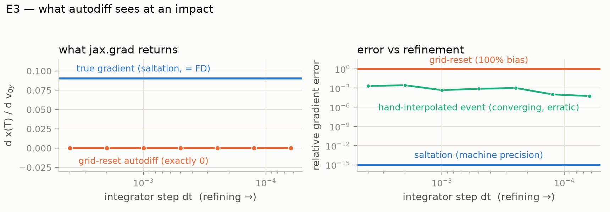
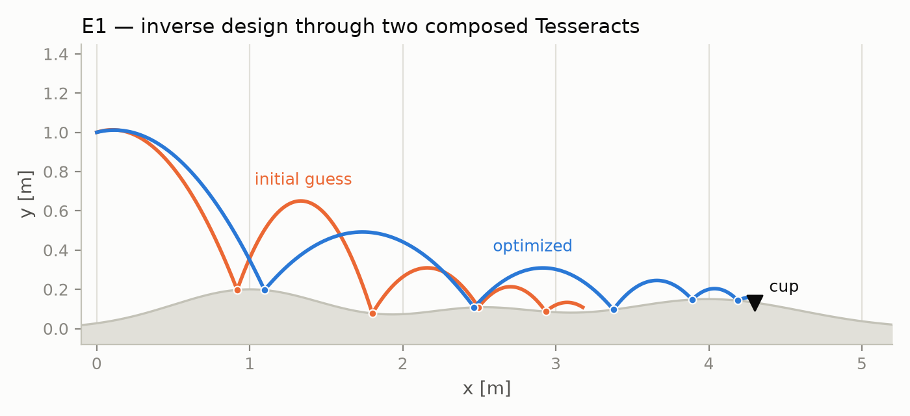
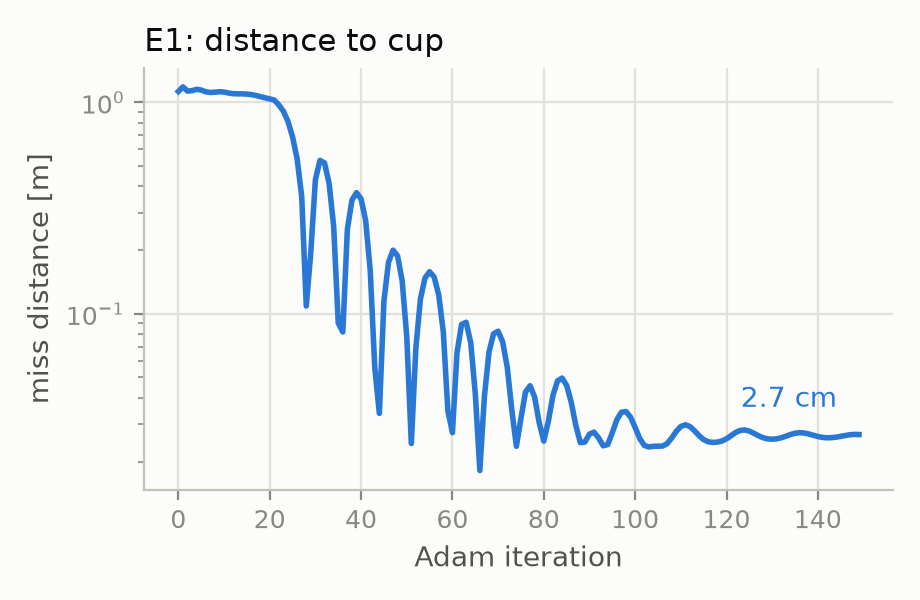

# impact-adjoint: end-to-end gradients through impact events

**Track 1 — Inverse design & shape optimization** (cross-listed: Track 4,
differentiable inference). Solo entry.

## 1. The problem: gradients die at events, quietly

Differentiable simulation has a well-known failure mode that is worse than an
exception: it returns confident, finite, *wrong* gradients. It happens wherever
the dynamics are event-driven — contact, impact, switching, thresholds. The
parameter-dependence of the *event time* contributes a term to the sensitivity
(the saltation term) that the autodiff of a time-stepping program structurally
cannot see: the step at which the event fires is an integer, piecewise-constant
in the parameters.

Experiment E3 makes this concrete. A pure-JAX simulation of a bouncing ball
(RK4 scan, reset applied at the grid point via `jnp.where`) converges to the
correct *trajectory* as `dt → 0` — and reports `d x(T)/d v0y = 0.0` at every
resolution. The true value is `+0.0904`, confirmed by two independent
witnesses. The bias is O(1) and refinement-proof:



This is not a strawman implementation; it is what `jax.grad` of the natural
program does. Fixing it requires event-time sensitivity machinery — a different
*differentiation semantics*, not a smaller `dt`.

## 2. What we built

A two-Tesseract pipeline in which the event-aware machinery lives behind a
Tesseract boundary, and JAX never needs to know:

```
(v0, e, mu, terrain θ)                                            optax Adam
      │                                                                ▲
      ▼                                                                │
┌────────────────────┐   qf, impact_x   ┌───────────────────┐   loss   │
│ contact-sim        │ ───────────────▶ │ score-target      │ ─────────┘
│ Julia · RK4+events │                  │ JAX · autodiff    │
│ variational + salt-│                  │ (cup objective)   │
│ ation sensitivities│                  └───────────────────┘
└────────────────────┘
        one jax.grad, via tesseract-jax
```

**contact-sim** (Julia): a 2D point mass under gravity (optional linear drag)
over smooth terrain `h(x)` (three Gaussian bumps). Guard `g(q) = y − h(x)`;
impact reset applies normal restitution `e` and tangential retention `1 − μ`
in the local terrain frame. Integration is RK4 with bisection-based event
localization (plus interior guard probes for sub-step terrain features).

Sensitivities propagate by the forward variational equation `Ẋ = (∂f/∂q) X`
on smooth segments; at each event, `X` jumps:

```
X⁺ = R_q X⁻ + R_θ − (f⁺ − R_q f⁻) τ_θᵀ,     τ_θ = −(X⁻ᵀ g_q + g_θ) / (g_q · f⁻)
```

— the saltation update. Local partials (`∂f/∂q`, `g_q`, `g_θ`, `R_q`, `R_θ`)
come from ForwardDiff dual numbers; the event structure is handled
analytically. From the assembled Jacobian, the Tesseract serves `jacobian`,
`jacobian_vector_product`, and `vector_jacobian_product`, so `jax.grad`,
`jax.jvp`, and `jax.jacrev` all work through it.

**score-target** (JAX): a differentiable landing objective (quadratic distance
to a cup plus kinetic penalty), built with the `tesseract init --recipe jax`
endpoints.

### Why this needs Tesseract

The two components disagree about how to compute *and* how to differentiate:
dual-number forward AD plus analytic event handling in a Julia process, versus
reverse-mode tracing autodiff in JAX. There is no way to express the saltation
update inside `jax.grad`'s programming model without reimplementing the solver
as a JAX custom primitive with hand-written VJPs — at which point you have
written a worse, unshareable Tesseract. The Tesseract contract (typed schemas +
gradient endpoints) is exactly the seam: Julia publishes *what its derivatives
are*, not *how it got them*, and `tesseract-jax` splices them into JAX's chain
rule. The solver container is reusable as-is from any other client (PyTorch via
tesseract-torch, probabilistic stacks for Track 4, CLI).

A deliberate design point: when a trajectory leaves the model's validity region
— more impacts than the schema's capacity, or chatter toward the Zeno
accumulation — the solver *terminates at the event with an explicit status*
and returns the **total derivative at the truncation point** (event-time
dependence included). Optimizers therefore never consume silently nonphysical
states, and gradient descent remains well-posed even at the model's edges.
Robustness here is a gradient-correctness feature: our adversarial testing
showed that the naive alternative (integrate on, ignore events) produces
plausible-looking gradients of a ball in free-fall below the terrain.

## 3. Gradients doing real work

**E1 — inverse design.** Optimize launch velocity and restitution so the ball
lands in a cup at `x = 4.3` on bumpy terrain, 1.1 m past where the initial
guess settles. Adam, lr 0.03, 150 iterations, every step one `jax.grad`
through both Tesseracts:



Miss distance falls **1.12 m → 2.7 cm**, through five impacts. Notably, the
optimizer crosses bounce-count boundaries (4 → 6 → 5 bounces) during descent —
the objective is discontinuous there (inherent to contact), and the
fixed-topology gradients on each side are exact, which is what carries Adam
through:



**E2 — calibration (Track 4 flavor).** Recover material parameters `(e, μ)`
from the *positions of three impacts* observed with 5 mm noise. The observable
exists only because of events — there is no smooth surrogate for "where it
hit". Gradient descent through the solver's VJP recovers `e` to 0.002 and `μ`
to 0.009 (noise-limited) from a distant start `(0.5, 0.3)`.

**E2b — Bayesian calibration (Track 4 proper).** The same inverse problem as a
posterior: NumPyro's NUTS sampler, whose Hamiltonian dynamics require a
JAX-differentiable log-density, runs directly against the *containerized*
solver — every leapfrog step calls the Tesseract's apply and saltation-VJP
endpoints over HTTP. Posterior: `e = 0.697 ± 0.008`, `μ = 0.096 ± 0.010`;
the truth lies within one standard deviation of both marginals. This is the
composition Track 4 asks for: an expensive event-driven solver dropped into a
probabilistic workflow unchanged.

## 4. Correctness: independent oracles, not self-agreement

FD-vs-analytic agreement through the same solver proves consistency, not
correctness. We therefore validated against two solver-independent oracles:

1. **Closed form** (flat terrain): the full multi-bounce trajectory and its
   Jacobian derived symbolically in rational arithmetic — including a
   hand-differentiated impact-position recursion and an implicit-function-
   theorem cross-check for terrain sensitivities. Solver agreement: primals
   ~1e-12, **Jacobian 7e-12**.
2. **Cross-implementation** (bumpy terrain, with and without drag): the spec
   reimplemented from scratch on scipy's adaptive RK45 with its own event
   localization. Primal agreement 1e-10; the solver's analytic Jacobian
   matches finite differences *through the independent implementation* to
   **5e-9** — covering exactly the sloped-contact-frame and drag sectors the
   flat oracle cannot reach.

The regression suite additionally pins: energy conservation at `e = 1`
(relative drift 5e-13 across five impacts — RK4 is exact on ballistic arcs and
events are localized to machine precision), chatter termination, event-capacity
truncation, sub-step terrain-feature detection, and `jax.grad` end-to-end
equality with FD for all seven differentiable inputs.

Near-grazing behavior matches theory: impact sensitivities grow as
`δ^(−1/2)` approaching tangency, and analytic-vs-FD agreement holds down to
`δ ≈ 1e-8`, beyond which FD itself is invalid.

## 5. Limitations

- The impact law is kinematic Newton restitution + tangential retention, not a
  Coulomb cone; sticking/sliding contact modes are out of scope (explicit
  `status=2` termination instead of pretending).
- Gradients are exact at fixed event topology; the objective is discontinuous
  across bounce-count boundaries (physical, and visible in E1).
- Event detection resolves terrain features wider than `|vx|·dt/3`; the
  constraint is documented on the input schema.
- 2D, single body. The saltation machinery is dimension-agnostic; the scope is
  a deliberate trade for verified correctness within the hackathon period.

## 6. Reproducibility

Everything (validation, experiments, figures) reproduces with the commands in
the README, CPU-only, in minutes. The Docker images build for arm64 and x86_64.

---

*All code written during the hackathon period (Aug 2026). Apache License 2.0.*
