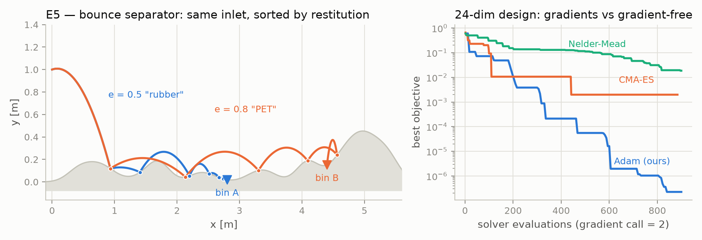
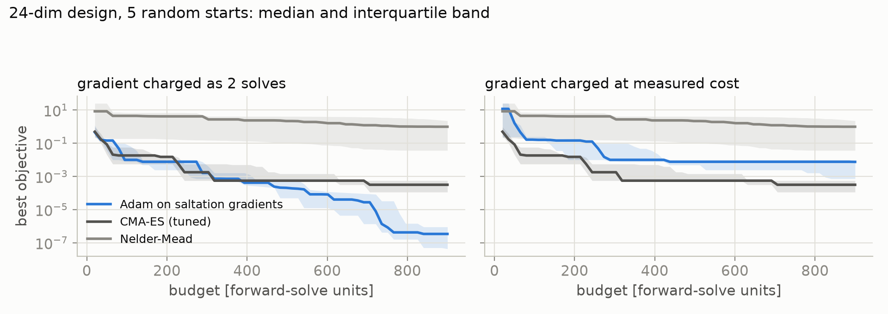
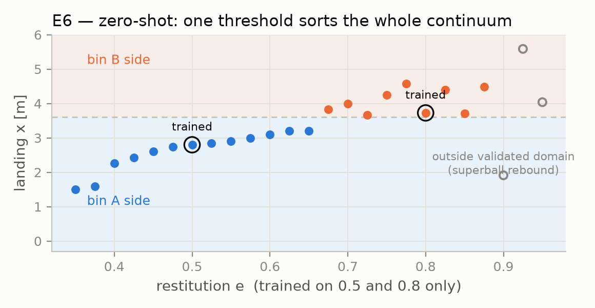
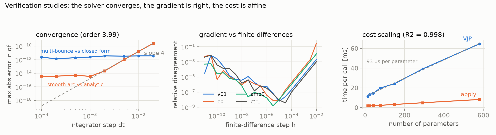
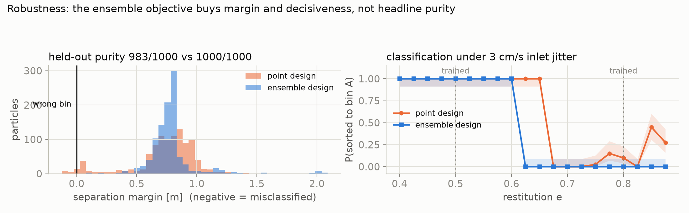

# impact-adjoint: end-to-end gradients through impact events

**Track 1: inverse design & shape optimization.** Solo entry. (Experiments
E2b and E5b also speak to Track 4, differentiable inference and UQ, but the
headline result is a designed structure and Track 1 is the entry's track.)

This entry differentiates *through impacts* exactly, rather than by
smoothing them, and uses the result to design passive structures whose
function only exists because of those impacts. Sorting by resilience is real
machinery: USDA Agriculture Handbook 354 (1968) describes a resilience
separator as "a long inclined plane interrupted with several bounce plates",
and bounce rollers are sold today to separate potatoes from stones.
Simulating that class of machine differentiably is exactly where standard
autodiff fails silently.

## 1. The problem: gradients die at events, quietly

Differentiable simulation has a well-known failure mode that is worse than
an exception: it returns confident, finite, *wrong* gradients. It happens
wherever the dynamics are event-driven, whether that is contact, impact,
switching or thresholds. The parameter-dependence of the *event time* contributes a term
to the sensitivity (the saltation term) that the autodiff of a time-stepping
program structurally cannot see: the step at which the event fires is an
integer, piecewise-constant in the parameters.

Experiment E3 makes this concrete, and includes its own steelman. A pure-JAX
simulation of a bouncing ball (RK4 scan, reset applied at the grid point via
`jnp.where`) converges to the correct *trajectory* as `dt → 0`, yet reports
`d x(T)/d v0y = 0.0` at every resolution (an exact zero specific to
state-independent resets over flat terrain; on curved terrain the same
program returns nonzero *wrong* values instead). The true value is
`+0.0904`, which the closed-form oracle of Section 4 pins independently of
this solver. The honest repair inside pure JAX, interpolating the crossing
time from the guard and resetting at the interpolated state, recovers a
converging gradient. That is the point. The repair *is* first-order
event-time sensitivity machinery, hand-implemented, with
dt-dependent, non-monotone error (2×10⁻³ → 6×10⁻⁵ over our sweep) and a new
hand derivation owed for every guard/reset pair. The saltation endpoint
serves the exact value at every `dt` with no event handling in the consuming
program at all:


## 2. What we built

A two-Tesseract pipeline in which the event-aware machinery lives behind a
Tesseract boundary, and JAX never needs to know:

```
  ┌──────────────────────── one jax.grad, via tesseract-jax ────────────────┐
  │                                                                         │
  ▼                                                                         │
(v0, e, mu, terrain θ)                                           optax Adam ┘
      │                                                                ▲
      ▼                                                                │
┌──────────────────────┐  qf, impact_x  ┌───────────────────┐   loss   │
│ contact-sim          │ ─────────────▶ │ score-target      │ ─────────┘
│ Julia · RK4 + events │                │ JAX · autodiff    │
│ variational X +      │                │ (landing          │
│ saltation jumps      │                │  objective)       │
└──────────────────────┘                └───────────────────┘
```

**contact-sim** (Julia): a 2D point mass under gravity (optional linear
drag) over smooth terrain `h(x)` built from configurable Gaussian bumps (3
in E1/E4, 24 in E5). Guard `g(q) = y − h(x)`; impact reset applies normal
restitution `e` and tangential retention `1 − μ` in the local terrain frame.
Integration is RK4 with bisection-based event localization (plus interior
guard probes for sub-step terrain features).

Sensitivities propagate by the forward variational equation `Ẋ = (∂f/∂q) X`
on smooth segments; at each event, `X` jumps:

```
X⁺ = R_q X⁻ + R_θ − (f⁺ − R_q f⁻) τ_θᵀ,     τ_θ = −(X⁻ᵀ g_q + g_θ) / (g_q · f⁻)
```

This is the saltation jump condition applied to the θ-augmented system
(θ̇ = 0), which is the form Hiskens & Pai give (eqs. 57 to 59 with the
parameter augmentation of 62 to 63). One detail worth flagging, since the
most-cited statements of the saltation matrix are for time-varying guards:
because parameters are constant along the flow, `∂g/∂θ` enters the
event-time *numerator*, not the denominator where an explicit `∂g/∂t` would
sit. Local partials (`∂f/∂q`, `g_q`, `g_θ`, `R_q`, `R_θ`) come from
ForwardDiff dual numbers; the event structure is handled analytically. From the assembled Jacobian, the Tesseract serves `jacobian`,
`jacobian_vector_product`, and `vector_jacobian_product`, so `jax.grad`,
`jax.jvp`, and `jax.jacrev` all work through it.

On cost: the sensitivities are *forward*-variational, so a VJP costs
O(n_params), measured at 6.0× a forward solve for 14 parameters and 8.5× for
77 (apply 2.0 / 4.9 ms, VJP 12.1 / 41.6 ms warm). That is the right trade at
tens of design variables. At thousands, the natural extension is a
reverse-mode saltation adjoint behind the same endpoint.

**score-target** (JAX): a differentiable landing objective (quadratic
distance to a cup plus kinetic penalty), built with the `tesseract init
--recipe jax` endpoints.

### Why this needs Tesseract

The two components disagree about how to compute *and* how to differentiate:
dual-number forward AD plus analytic event handling in Julia, versus
reverse-mode tracing in JAX. To be precise about what JAX already does here:
Diffrax has differentiated event times since v0.6.0, by implicit
differentiation through an Optimistix root find, so a single event is handled
natively and correctly. What is missing is the rest of a hybrid trajectory.
`diffrax.Event` terminates a solve and has no reset map, so a multi-impact
chain must be assembled by restarting the solver after each event and
applying the reset in user code. That route is expressible, and it is
currently unreliable: Diffrax issue #729 reports exactly this pattern
returning solver-dependent wrong gradients (0.50 with Heun, -1.42 with Tsit5,
0.78 with Bosh3, against a true value of 1.0), and the maintainer's fix
branch is unmerged. Rather than build on that, the event-aware machinery
sits behind the component contract: Julia publishes *what its derivatives
are*, not *how it got them*, and `tesseract-jax` splices them into JAX's
chain rule.

When a trajectory leaves the model's validity region (event capacity, Zeno
chatter), the solver terminates at the event with an explicit status and
returns the total derivative at that point, event-time dependence included,
so optimizers never consume silently nonphysical states. The alternative,
integrating on and ignoring events, produces plausible-looking gradients of
a ball in free-fall below the terrain.

## 3. Gradients doing real work

**E1, inverse design.** Optimize launch velocity and restitution so the
ball lands in a cup 1.1 m past where the initial guess settles, every Adam
step one `jax.grad` through both Tesseracts
([trajectory](figures/e1_trajectory.png),
[convergence](figures/e1_convergence.png),
[animation](figures/e1_optimization.gif)). Miss distance falls **1.12 m →
2.7 cm** through five impacts, with the optimizer repeatedly crossing
bounce-count boundaries on the way (4 → 6 → 5, with excursions to 8). The
objective is discontinuous at those crossings, which is inherent to contact;
the fixed-topology gradients on each side are exact, and that is what
carries Adam through.

**E2 and E2b, calibration (Track 4).** Recover material parameters `(e, μ)`
from the *positions of three impacts* observed with 5 mm noise, an
observable that exists only because of events. Point estimation via the solver's
VJP recovers `e` to 0.002 and `μ` to 0.009 from a distant start. For the
posterior, NumPyro's NUTS sampler runs directly against the *containerized*
solver. Every leapfrog step calls the Tesseract's apply and
saltation-VJP endpoints over HTTP, roughly 10,000 solver calls per chain. Two
chains, zero divergences, r̂ = 1.01: posterior `e = 0.697 ± 0.007`, `μ =
0.096 ± 0.009`, with the truth inside the 68% and 95% credible intervals of
both marginals. The posterior also resolves the physically meaningful e–μ
ridge, more bounce traded against more tangential loss
([figure](figures/e2b_posterior.png)).

This is the composition Track 4 asks for: an expensive event-driven solver
dropped into a probabilistic workflow unchanged. The container is
load-bearing rather than packaging, since NumPyro's jitted callbacks run off
the main thread and an in-process embedded Julia runtime does not tolerate
that, while over HTTP the problem does not arise (reported upstream as
tesseract-jax#234). The same solver is also driven with nothing but `curl`
(`scripts/second_client_curl.sh`).

**E4, terrain design.** The terrain parameters are differentiable inputs,
so the *structure* can be the design variable: one terrain routes balls
entering at 1.6 and 2.6 m/s to two different cups (miss 2.88 m / 0.48 m
falling to **2.2 / 3.0 cm**); the optimizer flattens two bumps and keeps one
narrow deflector the slow ball cannot clear
([figure](figures/e4_sorter.png)).

**E5, the headline: a 24-dimensional resilience separator, head to head.**
Resilience separators sort particles by how far they bounce off a profiled
hard surface. We design one: two particles enter *identically* and differ
only in restitution (`e = 0.5` and `e = 0.8`); the design vector is the 24
bump amplitudes of the surface; each particle must land in its own bin.



The designed surface separates the materials from a shared first impact.
the low-restitution particle is still over bin A when its eighth impact
exhausts the event budget, while the high-restitution one carries over the
designed hills into bin B (the optimizer grew a backstop that bounces it
*backward* into that bin), with landing errors of
0.
One caveat this design shares with any fixed-length chute: the
low-restitution particle is stopped by the solver's event budget
(`MAX_EVENTS = 8`) rather than by coming to rest, so the separation surface
is "position after eight impacts", not "position at rest". A chute of fixed
length imposes an analogous cut, though not the identical one.38 mm and 0.34 mm. The right panel plots the race under the
evaluation-count accounting. A single run from one start point cannot settle
a method comparison, so `experiments/study_optimizers.py` repeats it from
five random starts with both methods tuned over a grid per seed (learning
rate for Adam, sigma0 for CMA-ES) and reports medians with interquartile
bands under both accountings:



Per evaluation, gradients win decisively: median final objective 3.4×10⁻⁷ for
Adam against 3.2×10⁻⁴ for tuned CMA-ES, a factor of about 900, with
Nelder-Mead three orders behind that. Charged by measured wall-clock, where
each gradient call costs 8.5 forward solves, the ranking reverses at this
budget: Adam reaches 7.6×10⁻³ while CMA-ES is roughly 24 times better.

We report the reversal because it is real, and because it is an
implementation property rather than a fact about gradients. The VJP is
forward-variational, so it pays one variational column per parameter, 93
microseconds each as measured in the scaling study. A reverse-mode saltation
adjoint would return the same gradient for roughly the cost of one solve,
which would make the wall-clock panel resemble the evaluation panel. What
does not change under either accounting is that the gradient-free methods
never reach the design: in 24 dimensions they plateau three to five orders
above what Adam attains per evaluation.

**E5b, design under uncertainty.** Real separators process streams with
scatter, so we make the expected loss over a particle ensemble (inlet
velocity sd 5 cm/s, per-particle restitution sd 0.03, fixed common random
numbers, so the ensemble gradient is exact) the design objective. Two results:
the E5 point design is already robust, scoring 199 of 200 on the held-out
ensemble, and ensemble refinement scores 200 of 200. That last step is a
one-particle difference and should not be read as a significant gain. The
result worth reporting is the margin: refinement widens the gap between the
two landing distributions at the decision boundary, which is what would
matter on a real machine ([figure](figures/e5b_purity.png)).

**E6, zero-shot generalization.** The E5 surface was
optimized for exactly two restitution values. Sweeping the continuum it
never saw, the designed geometry acts as a *classifier*: every material with
`e ∈ [0.35, 0.875]` is binned by a single threshold (A up to `e = 0.65`, B
from `e = 0.675`). The binning quantity is the x-coordinate where the run
ends, which for 19 of the 22 in-domain points is the event-capacity
truncation at the eighth impact rather than a settled rest position: the
classifier is "which side the particle is on after eight impacts", which is
the honest reading of a fixed-length chute. Margins are asymmetric and worth
stating: the trained `e = 0.5` point lands 0.80 m clear of the decision
boundary, the trained `e = 0.8` point only 0.13 m. Under 3 cm/s of
inlet-velocity scatter at off-design materials, `e = 0.45` classifies 12 of
12 correctly and `e = 0.85` 10 of 12. The failure edge is physical and we
report it: from `e = 0.9` upward classification stops being clean. At `e =
0.9` the ball rebounds off the backstop and exits left into the wrong bin;
at `e = 0.925` it overshoots 1.2 m past bin B; at `e = 0.95` it lands
between the bins on a capacity-truncated trajectory. Nothing in the
objective asked for any of this. The generalization emerged from optimizing
two point designs through their impact events:



## 4. Correctness: independent oracles, not self-agreement

FD-vs-analytic agreement through the same solver proves consistency, not
correctness. We therefore validated against two solver-independent oracles:

1. **Closed form** (flat terrain): the full multi-bounce trajectory and its
   Jacobian derived symbolically in rational arithmetic, including a
   hand-differentiated impact-position recursion and an implicit-function-
   theorem cross-check for terrain sensitivities. Solver agreement: primals
   ~1e-12, **Jacobian 7e-12**.
2. **Cross-implementation** (bumpy terrain, with and without drag): the spec
   reimplemented from scratch on scipy's adaptive RK45 with its own event
   localization. Primal agreement 1e-10; the solver's analytic Jacobian
   matches finite differences *through the independent implementation* to
   **5e-9**, covering exactly the sloped-contact-frame and drag sectors the
   flat oracle cannot reach.

The regression suite additionally pins: energy conservation at `e = 1`
(relative drift 5e-13 across five impacts, since RK4 is exact on ballistic arcs
and events are localized to machine precision), chatter termination,
event-capacity truncation, sub-step terrain-feature detection, and
`jax.grad` end-to-end equality with FD for all seven differentiable inputs.

Near tangency the impact sensitivities grow as `δ^(−1/2)` (the saltation
denominator `g_q · f⁻` vanishes at grazing), a property of the physics, not
an artifact; the solver raises an explicit error at degenerate crossings
rather than returning an unbounded gradient.

## 4b. Verification studies

Four studies check the machinery itself rather than any application, each
writing an artifact that `experiments/collect_results.py` reads into
`docs/RESULTS.md`, so no number in this document is retyped by hand.



The solver converges at **order 3.99** on a smooth arc measured against the
analytic drag solution, and the multi-bounce flat case sits at 10⁻¹² against
the symbolic closed form, where the floor is event localization rather than
the integrator. Gradient agreement with central differences traces the
expected V in the step size on all four probes, bottoming below 10⁻⁸: a
wrong analytic gradient would show a flat floor instead of a V, because the
disagreement would be dominated by the gradient error rather than the step.
Cost is affine in parameter count (R² = 0.998, 93 microseconds per
parameter), which is what makes the reverse-mode extension a measured
argument rather than a preference.



Two robustness studies replace single draws with statistics. Over five
independent 200-particle ensembles, the point design classifies 983 of 1000
and the ensemble design 1000 of 1000, with non-overlapping Wilson intervals;
more usefully, the fifth-percentile separation margin improves from 0.05 m to
0.58 m (bootstrap 95% interval [+0.48, +0.55] m) and the worst case moves
from inside the wrong bin to 0.09 m clear of the boundary. Sweeping
restitution under inlet jitter shows what the deterministic sweep hid: the
point design is indecisive at 5 of 20 restitutions, including its own trained
value of 0.8, where 10% of jittered draws cross into the wrong bin. The
ensemble design is unanimous at all 20. Designing against the ensemble is
what buys that, and it costs a little median margin to get it.

## 5. Related work: how everyone else gets contact gradients

Existing engines obtain contact gradients by AD through smoothed/penalty
stepping (Brax, NeurIPS 2021; DiffTaichi, ICLR 2020; gradSim, ICLR 2021), by
implicit differentiation of a relaxed complementarity solve (Dojo, arXiv
2022; Nimble, RSS 2021), or from learned contact models (Zhong et al.,
NeurIPS 2021), each trading event-gradient fidelity for what the host
framework can express; Suh et al. (ICML 2022) document the resulting bias.
The exact alternative is classical: the **saltation matrix** (Aizerman &
Gantmacher 1958; Hiskens & Pai, IEEE TCAS 2000; surveyed by Kong et al.,
Proc. IEEE 2024). Our contribution is not the formula but the *packaging*:
exact event sensitivities behind Tesseract endpoints, consumable by
frameworks that cannot express them natively. The closest JAX-native
alternative is Diffrax (Kidger, 2021), which does differentiate event times
correctly, by implicit differentiation of a root find, and tests that
derivative against a hand-derived reference. The gap is not the event time
but the reset: `diffrax.Event` only terminates a solve, so no saltation
matrix arises there by construction, and hybrid support is still an open
request (issue #423).

Designing fixed environment geometry through contact-driven simulation is not
itself new. Choi & Kumar (2024) optimize baffle placement by AD through a
differentiable granular simulator, Liu et al. (AIChE J., 2025) optimize
hopper shape the same way, and non-gradient scene and part-feeder design goes
back further (Roussel et al., SIGGRAPH 2019; Berkowitz & Canny, ICRA 1996).
Those works differentiate a smoothed or learned model of contact and target a
bulk flow statistic. What we could not find in the literature is design that
uses *exact event-time sensitivities* and targets *per-impact routing* of
individual trajectories, which is the combination E4 and E5 exercise.

## 6. Limitations

- Impact law: kinematic Newton restitution + tangential retention, not a
  Coulomb cone; sticking/sliding modes terminate explicitly (`status=2`).
- Gradients are exact at fixed event topology; objectives are discontinuous
  across bounce-count boundaries (physical; visible in E1).
- Event detection resolves features wider than `|vx|·dt/3` (documented on the
  schema); 2D single body, a deliberate trade for verified correctness
  within the hackathon period.

## 7. Reproducibility

Everything reproduces with the README commands, CPU-only, in minutes; images
build for arm64 and x86_64; CI runs the full validation chain on every push.

Building this surfaced several problems in the stack, which were reported and
fixed upstream during the hackathon period:

- [tesseract-core#666](https://github.com/pasteurlabs/tesseract-core/issues/666)
  and PR [#667](https://github.com/pasteurlabs/tesseract-core/pull/667): the
  experimental VJP cache compared keys by hash alone with no stored key, so a
  collision silently served another input's backward pass. Reproduced on the
  shipped `vectoradd_jax` example using `hash(-1) == hash(-2)`, where both are
  valid norm orders. A second bug in the same path broke `apply` for non-JAX
  inputs.
- [tesseract-jax#235](https://github.com/pasteurlabs/tesseract-jax/issues/235)
  and PR [#236](https://github.com/pasteurlabs/tesseract-jax/pull/236):
  `jax.jvp` shipped the tangent under the wrong list index when only some
  elements of a `list[Differentiable[...]]` input were differentiated, so
  forward and reverse mode disagreed with no error raised.
- [tesseract-jax#234](https://github.com/pasteurlabs/tesseract-jax/issues/234):
  jitted callbacks deadlock a Tesseract that embeds an in-process Julia
  runtime, which is why E2b runs against the container. Filed with a minimal
  reproducer at
  [tesseract-jax-234-repro](https://github.com/singhharsh1708/tesseract-jax-234-repro).
- [mosaic#126](https://github.com/pasteurlabs/mosaic/pull/126) and
  [#141](https://github.com/pasteurlabs/mosaic/pull/141): harness fixes for
  Docker setup diagnostics and anomaly status reporting.

---

*All code written during the hackathon period (Aug 2026). Apache License
2.0.*
